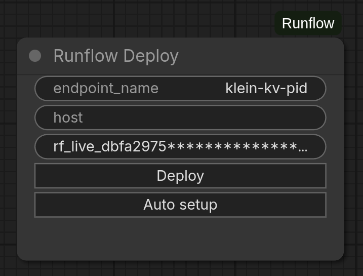
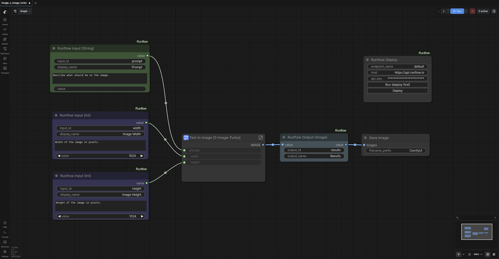
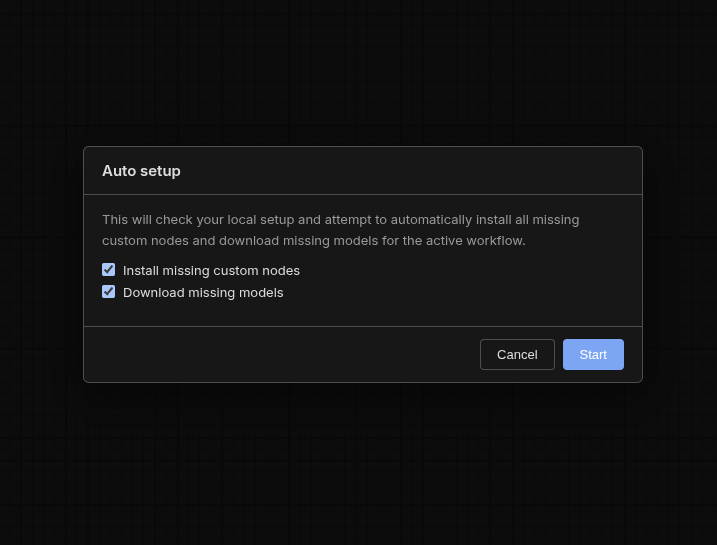
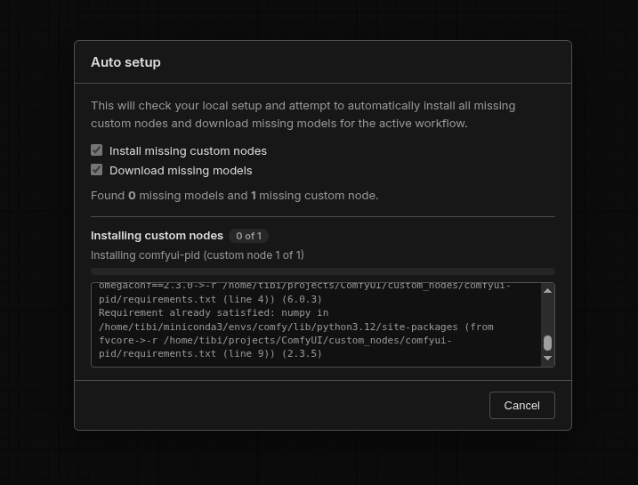
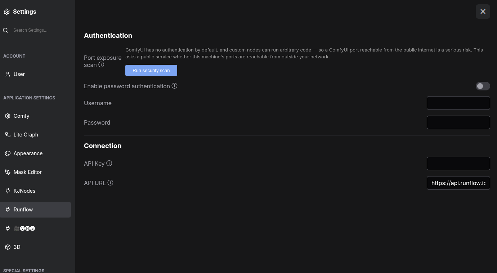
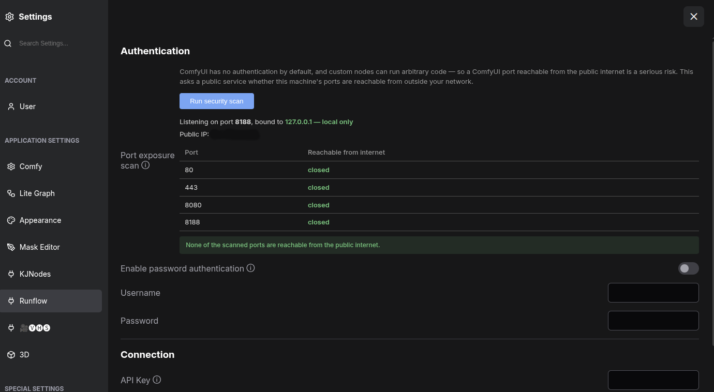

# ComfyUI-Runflow

> Turn any ComfyUI workflow into a callable API with one click.

A ComfyUI custom-node plugin that publishes a workflow to [Runflow](https://runflow.io) as a stable HTTP endpoint. The plugin captures the workflow graph, the runtime manifest (ComfyUI commit, custom-node commits, package versions, cached-model state), and uploads it to Runflow — no Dockerfile, no GPU provisioning, no glue code.

[**Documentation**](https://docs.runflow.io/guides/comfyui-deploy) · [**API Reference**](https://docs.runflow.io) · [**Pricing**](https://www.runflow.io/pricing) · [**Releases**](https://github.com/runflow-io/ComfyUI-Runflow/releases)

<p align="center">
  
</p>

---

## Status

**Public beta.** The plugin, API surface, and pricing are stable but subject to change. Pin a commit SHA if you need version guarantees, and watch the [changelog](https://github.com/runflow-io/ComfyUI-Runflow/releases) for breaking changes.

## Security warnings — read first

### Never put your API key on the node

ComfyUI persists widget values into the workflow JSON, so a key entered into the Deploy node's `api_key` widget travels with every export, screenshot, paste, and bug-report attachment. **Configure your key under Settings → Runflow → Connection instead** — those values are machine-local and never written to workflow files. Before deploying any imported workflow, clear both the `host` and `api_key` widgets (or recreate the node).

### Auto setup runs untrusted code

The **Auto setup** button executes `git clone` and `pip install` against URLs declared by the loaded workflow. Treat it like running an untrusted shell script — only enable it for workflows from sources you trust.

### ComfyUI ships with no authentication

If you start ComfyUI with `--listen` and the port is reachable from the public internet, anyone who finds it can run code on your machine. Use the built-in port-exposure scan (below) and enable password auth before exposing the server.

---

## Quick start

1. **Install the plugin** — clone into `custom_nodes/` and restart ComfyUI.
2. **Configure credentials** — Settings → Runflow → Connection, paste your API key.
3. **Deploy** — drop a Runflow Deploy node into your workflow, name your endpoint, click **Deploy**.

## Prerequisites

- A working ComfyUI installation.
- A Runflow API key with the right [scopes](https://app.runflow.io/settings/api-keys) (see below).
- `python`, `pip`, and `git` on PATH (only needed for the optional Auto setup).

### API key scopes

| You want to… | Required scopes |
|---|---|
| Publish a new endpoint | `comfyui-workflows:read` + `comfyui-workflows:create` |
| Redeploy / iterate on an existing endpoint | …add `comfyui-workflows:edit` |
| Delete endpoints from this client | …add `comfyui-workflows:delete` |

The plugin sends `Authorization: Bearer <key>` and lets the API derive your organization from the key — no organization UUID needed.

---

## Installation

```bash
cd <ComfyUI>/custom_nodes
git clone https://github.com/runflow-io/ComfyUI-Runflow.git
# Or, for development against this checkout:
ln -s /path/to/ComfyUI-Runflow ComfyUI-Runflow
```

A full ComfyUI **process** restart is required (browser refresh is not enough). After restart, a **Runflow** category appears in the node picker.

## Configure your account

Open **Settings → Runflow → Connection**:

| Setting | Default | What it is |
|---|---|---|
| `Runflow.ApiUrl` | `https://api.runflow.io` | Runflow API base URL. Override only for a local/staging stack. |
| `Runflow.ApiKey` | _(empty)_ | A `rf_live_*` API key issued for your organization. |

Both fields can also be overridden per-workflow on the Deploy node's `host` / `api_key` widgets — but see the [security warning above](#never-put-your-api-key-on-the-node) before doing so.

## Deploy

1. Add a **Runflow Deploy** node from the Runflow category.
2. Set its `endpoint_name` widget. The slug is derived from this name (lowercased, spaces → hyphens, non-alphanumeric stripped). Example: `Background Removal v2.1` → `background-removal-v21`.
3. Click **Deploy**.

A `Deployed ✓` toast confirms success; failures surface as browser alerts with the error body. The HTTP response is the terminal state — there is no separate deployment job to poll.

> Renaming `endpoint_name` creates a **new** endpoint. Keep the name stable to redeploy onto the same slug.

## Video walkthrough

[](https://www.youtube.com/watch?v=Gxdc1ne7kyk)

> [Watch on YouTube ▶](https://www.youtube.com/watch?v=Gxdc1ne7kyk)

---

## Define your API: Runflow Input / Output nodes

Place a typed `Runflow Input (…)` node for each value your endpoint accepts and a `Runflow Output (…)` node for each artifact it returns. The `input_id` / `output_id` widgets are the stable keys callers use against the API.

<p align="center">
  
</p>

### Input nodes

| Node | Class | Default ID |
|---|---|---|
| `Runflow Input (String)` | `RunflowInputString` | `string_input` |
| `Runflow Input (Int)` | `RunflowInputInt` | `int_input` |
| `Runflow Input (Float)` | `RunflowInputFloat` | `float_input` |
| `Runflow Input (Boolean)` | `RunflowInputBoolean` | `boolean_input` |
| `Runflow Input (Image)` | `RunflowInputImage` | `image_input` |

Locally each input is a pass-through; at deploy time the rewriter injects caller-supplied values. Use the `display_name` and `description` widgets to label the field in the Runflow playground.

### Output nodes

| Node | Class | Default ID | What it does |
|---|---|---|---|
| `Runflow Output (Image)` | `RunflowOutputImage` | `image_output` | Saves each image in the batch as PNG to `output/`. |
| `Runflow Output (File)` | `RunflowOutputFile` | `file_output` | Marks a file already written under `output/` (by an upstream save-* node) as the run's deliverable. Use for video, 3D meshes, audio, archives, etc. |

### Encoder bridges (Runflow/Save category)

These nodes encode native ComfyUI sockets to a file in `output/` and emit the relative filename on a STRING socket — wire that into `Runflow Output (File)`.

| Node | Input | Format / codec |
|---|---|---|
| `Runflow Save Audio (FLAC)` | AUDIO | FLAC, lossless |
| `Runflow Save Audio (MP3)` | AUDIO | MP3 / libmp3lame, with `quality` widget (`V0`, `128k`, `320k`) |
| `Runflow Save Audio (Opus)` | AUDIO | Opus / libopus, with bitrate widget (`64k`–`320k`) |
| `Runflow Save Video (MP4)` | VIDEO | MP4 / H.264 (delegates to `VIDEO.save_to`) |
| `Runflow Save Video (WEBM)` | IMAGE batch + fps | WebM / VP9 or AV1 — mirrors stock ComfyUI's `SaveWEBM` input shape |

The audio nodes delegate to ComfyUI's `AudioSaveHelper`, so encoding stays in lockstep with stock `Save Audio`. The MP4 node calls the VIDEO socket's own `save_to(...)`. The WEBM node uses PyAV directly because the VIDEO socket only supports MP4/H.264 today.

These nodes require a recent ComfyUI (`comfy_api.latest` module). On older installs they're skipped at load with a single warning — the rest of the plugin still works.

---

## Calling your deployed workflow

Once deployed, the workflow is available as an HTTP endpoint:

```
POST https://api.runflow.io/v1/models/{org}/{endpoint}/runs
```

### Example

```bash
curl -X POST https://api.runflow.io/v1/models/your-org/your-endpoint/runs \
  -H "Authorization: Bearer $RUNFLOW_API_KEY" \
  -H "Content-Type: application/json" \
  -d '{
    "input": {
      "prompt": "a sea otter holding a smooth pebble, studio photography",
      "width": 1024,
      "height": 1024
    },
    "callback_url": "https://your-server.com/webhook"
  }'
```

### Response

```json
{
  "id": "01J0...",
  "status_code": "succeeded",
  "output": {
    "image": ["https://..."]
  }
}
```

Output URLs are presigned and time-limited — download or rehost immediately. See [Runs](https://docs.runflow.io/concepts/runs) for the full lifecycle (polling, callbacks, retries) and [Verify Callback Signatures](https://docs.runflow.io/guides/verify-callback-signatures) for HMAC verification of webhook payloads.

---

## Billing & GPU pricing

Runs are billed per second of GPU time. By default the platform picks the cheapest GPU that fits the workflow's memory requirements; you can pin a specific model via `PATCH /v1/comfyui-workflows/{id}`.

| GPU | Memory | Per-second rate | Use case |
|---|---|---|---|
| L4 | 24 GB | $0.000147/s | SDXL, light workflows |
| A10G | 24 GB | $0.000222/s | Mid-range SDXL, small video |
| L40S | 48 GB | $0.000444/s | Flux, Wan, large image models |
| A100 | 80 GB | $0.000917/s | Heavy video, large-memory models |
| H100 | 80 GB | $0.00125/s | High-throughput video production |

See [runflow.io/pricing](https://www.runflow.io/pricing) for current rates. Workers scale to zero when idle, so the next run after a quiet period pays a 10–40s cold-start. For latency-sensitive workloads, schedule warming runs or keep a playground tab open.

---

## Auto setup

The **Auto setup** button (directly below Deploy on the Runflow Deploy node) installs every custom node and downloads every model the active workflow needs. Useful when you load someone else's workflow and don't want to chase dependencies by hand.

<p align="center">
  
</p>

Clicking the button opens a modal with two checkboxes — *Install missing custom nodes* and *Download missing models* — and a Start button. While the job runs, the modal shows a byte-progress bar for the current download and a count-progress bar for the current custom-node install. Models and custom nodes run in parallel.

<p align="center">
  
</p>

When the job finishes, click **Restart ComfyUI** in the modal: the server re-execs itself, the modal waits for it to come back, and the page full-reloads so the newly installed nodes register.

### Requirements

Auto setup assumes `python`, `pip`, and `git` are on PATH. It uses `git clone --depth=1` + `git fetch --depth=1 origin <sha>` + `git checkout <sha>` (falling back to a full clone if the host disables SHA-targeted fetches), then `python -m pip install -r requirements.txt` if the cloned repo carries one. Works on Linux, macOS, and Windows.

> **Trust the workflow before clicking.** Auto setup will execute arbitrary URLs declared by the workflow file.

---

## Security panel (Settings → Runflow)

ComfyUI ships **no authentication** by default, and custom nodes can execute arbitrary code on the host. If you start ComfyUI with `--listen` (binding to `0.0.0.0` — all network interfaces) and the port is reachable from the public internet, anyone who finds it can run code on your machine. The Runflow security panel helps you detect and close that exposure.

<p align="center">
  
</p>

### Password authentication

| Setting | Default | What it does |
|---|---|---|
| `Enable password authentication` | _off_ | Require HTTP Basic auth for **all** requests to this ComfyUI server. |
| `Username` / `Password` | _(empty)_ | Credentials checked by the auth layer. |

When enabled with both fields set, a Basic-auth middleware guards every route. Credentials are stored in `runflow_security.json` next to your ComfyUI install. Browsers prompt once and cache the credentials for the session.

### Port exposure scan

Click **Run security scan** in the same panel to check whether this machine is exposed from the public internet:

<p align="center">
  
</p>

1. It reports ComfyUI's **listen binding** (read locally from ComfyUI's `--listen` / `--port` args). Binding to `0.0.0.0`/`::` is flagged in red; `127.0.0.1` is green.
2. It looks up your **public IP** (via `api.ipify.org`, falling back to `ifconfig.me`, `icanhazip.com`, and `checkip.amazonaws.com`).
3. It asks the public service **portchecker.io** whether ComfyUI's port (plus `80`, `8080`, `443`) is reachable from the internet, and shows each port as OPEN or closed.

> **Privacy note:** the scan sends your public IP address to portchecker.io so it can probe your ports from the outside. No workflow data is sent. If portchecker.io is unreachable, the scan still reports the local listen-binding status so you aren't left without a signal.

**If a port shows OPEN** (or you're bound to all interfaces), close the exposure by any of:

- Enabling **password authentication** above.
- Restricting access with a firewall / security group, or putting ComfyUI behind an authenticated reverse proxy.
- Binding to localhost only — start ComfyUI **without** `--listen` (or with `--listen 127.0.0.1`).

---

## Troubleshooting

| Symptom | Fix |
|---|---|
| No Runflow category in the node picker | Fully restart the ComfyUI **process**, not just the browser. |
| `Unconfigured key or URL` alert | Verify `Runflow.ApiKey` in Settings → Runflow → Connection; save and retry. |
| `401 Unauthorized` | API key is missing, revoked, or for the wrong environment. Reissue and re-save. |
| `lookup failed` or `403` on redeploy | Key needs `comfyui-workflows:read`, `create`, **and** `edit` scopes. |
| `endpoint_name must be URL-safe` | The slug came out empty after character stripping. Use alphanumerics and spaces/hyphens. |
| Workflow runs locally but fails on Runflow | Models or custom nodes aren't on the worker — run Auto setup locally first so the deploy manifest is complete. |
| Slug changed unexpectedly | Renaming `endpoint_name` creates a new endpoint. Keep the name stable to redeploy onto the same slug. |

---

## Related resources

- [**Pick a Model**](https://docs.runflow.io/guides/pick-a-model) — decision tree for choosing a model
- [**Runs**](https://docs.runflow.io/concepts/runs) — lifecycle, polling, callbacks
- [**Verify Callback Signatures**](https://docs.runflow.io/guides/verify-callback-signatures) — HMAC verification for webhooks
- [**JavaScript SDK**](https://docs.runflow.io/guides/javascript-sdk) — typed client library

---

## Contributing & support

Issues and pull requests are welcome on [GitHub](https://github.com/runflow-io/ComfyUI-Runflow/issues). For account, billing, or production-deployment help, contact Runflow support through [docs.runflow.io](https://docs.runflow.io).
